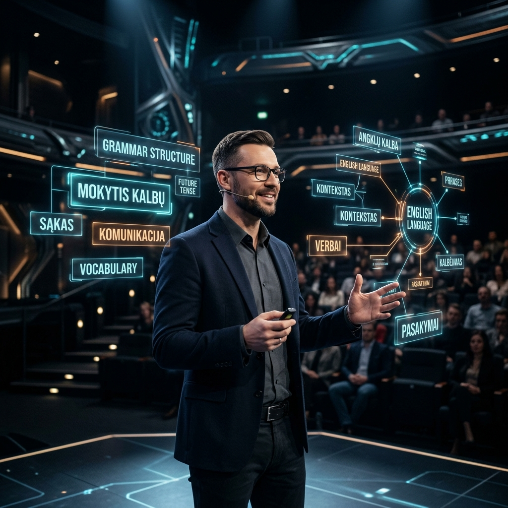

# 🏗️ Sistemos Architektūra (Developer Deep-Dive)

Šiame dokumente aprašoma **LtEng_26** pamatų logika, technologijų krūva (stack) ir ryšys tarp skirtingų komponentų.

## 1. Monorepo Struktūra ir Ryšiai
Projektas organizuotas kaip monorepo, leidžiantis lengvai valdyti tiek vartotojo sąsają, tiek serverio logiką.

```mermaid
graph TD
    Client[React Frontend - Port 5173] -->|API Proxy| Vite[Vite Dev Server]
    Vite -->|Local Proxy| LocalAPI[Node Local Server - Port 5001]
    LocalAPI -->|Prisma| DB[(SQLite/PostgreSQL)]
    
    subgraph "Production (Vercel)"
        VercelClient[Vercel Frontend] -->|Serverless Functions| VercelAPI[/api/index.js]
        VercelAPI -->|Prisma| CloudDB[(External PostgreSQL)]
    end
```

### Pagrindiniai komponentai:
- **Frontend (React + Vite)**: Pagrindinė aplikacijos dalis. Naudoja `Framer Motion` teatro efektams kurti.
- **Backend (Express + Prisma)**: 
    - Lokaliame rėžime (`npm run dev`) veikia per `local-server.js` (portas 5001).
    - Produkcijoje (Vercel) veikia per `/api/index.js` kaip serverless funkcija.
- **Proxy Mechanizmas**: `vite.config.js` peradresuoja visas `/api` užklausas į atitinkamą serverį, todėl frontend kodas (`axios`) visada kreipiasi į santykinį kelią `/api/...`.

## 2. Duomenų Modelis (Prisma)
Duomenų bazė valdo ne tik turinį, bet ir vartotojų progresą bei elgseną.

- **`User`**: Pagrindinė informacija ir RBAC rolės (`LEARNER`, `CREATOR`, `EDITOR`).
- **`EducationalMaterial`**: Pamokų turinys (JSON formatu `contentPayload`).
- **`History`**: Išsamus įvykių žurnalas (egzaminų rezultatai, sėkmės procentai).
- **`ContentVersion`**: Leidžia atkurti senesnes pamokų versijas po klaidų pildyme.

## 3. Vietinis Vystymas
Norint paleisti visą sistemą lokaliai:
1. Terminale įvykdykite `npm run dev`.
2. `concurrently` paleis abu serverius.
3. Patikrinkite `local-server.js` logus, užtikrinančius ryšį su DB.

> [!IMPORTANT]
> Keičiant DB schemą, nepamirškite paleisti `npx prisma generate` ir `npx prisma db push`.

---

*Sistemos loginė vizija: Mokytojas (AI/Petrovas) ir interaktyvios hologramos (Duomenys).*
