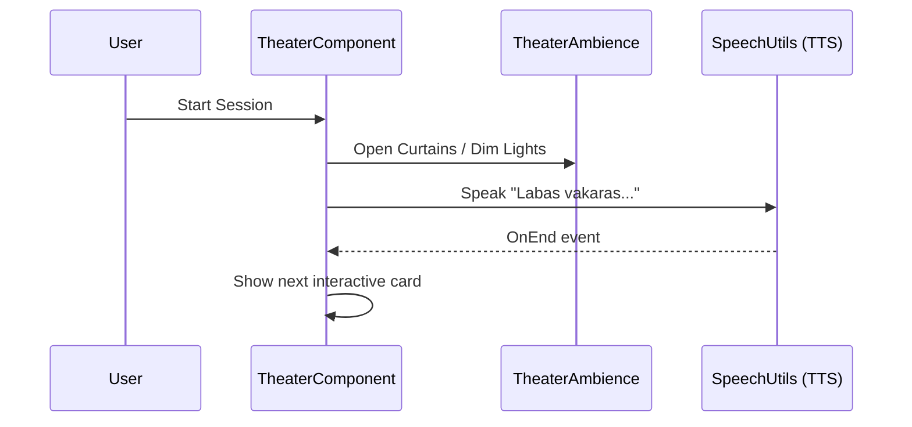

# 🧩 Pagrindiniai Komponentai ir Logika

Šiame dokumente gilinamės į unikalius **LtEng_26** elementus, kurie sukuria „Premium“ patirtį vartotojui.

## 1. Teatro Režimas (Theater Engine)
„Teatras“ nėra tiesiog vaizdas – tai sudėtingas React komponentų ir animacijų junginys.

### Veikimo principas:
- **`TheaterAmbience.js`**: Valdo „scenos“ būseną (užuolaidų praskleidimas, apšvietimas, dūmų efektai).
- **`useTheaterCamera.js`**: Dinamiškai keičia kameros fokusą priklausomai nuo to, kas kalba (Mokytojas vs Studentas).
- **Globalus "Freeze"**: Galimybė sustabdyti sesiją bet kuriame taške neprarandant konteksto.

## 2. Pagalbiniai įrankiai (Utilities)
- **Speech Synthesis (TTS)**: Naudoja naršyklės `window.speechSynthesis`. Konfigūruojama per `languageConfig.js`, leidžiant lengvai keisti kalbą į IT-LT ar kitą.
- **`recharts` Integracija**: Naudojama `StudioView` analitikai, braižant studentų progreso kreives.

## 3. Prieinamumas ir Nustatymai (`SettingsContext`)
Visi vizualiniai elementai (šrifto dydis, spalvų kontrastas) yra valdomi per centralizuotą Context API. Tai užtikrina, kad vyresnio amžiaus auditorija (50-60+) galėtų pilnai mėgautis platforma.

> [!TIP]
> Naujus komponentus kurkite naudodami `framer-motion` – tai raktas į premium lygio sklandumą.

---

*Studio Dashboard: Vieta, kurioje techninė logika virsta mokymo turiniu.*
