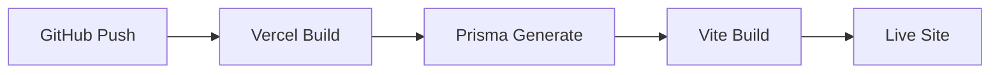

# 🚀 Diegimas, Priežiūra ir Žurnalavimas

Šiame dokumente aprašoma, kaip LtEng_26 iškeliauja į pasaulį ir kaip stebėti jos sveikatą.

## 1. Diegimo procesas (CI/CD)
Projektas yra optimizuotas „Vercel“ platformai, tačiau dėka Monorepo struktūros, gali būti pritaatytas bet kuriai Node.js aplinkai.

### Vercel Konfiguracija:
- **`vercel.json`**: Apibrėžia maršrutų perrašymą (`rewrites`), kad užklausos į `/api/*` pasiektų serverless funkcijas.
- **Prisma produkcijoje**: Prieš kiekvieną Build'ą Vercel aplinkoje paleidžiama `prisma generate`, užtikrinanti, kad DB klientas atitiktų schemą.

## 2. Įvykių ir klaidų stebėjimas
Sistema kaupia išsamius duomenis apie vartotojų elgseną.

- **`UserEvent` lentelė**: Fiksuoja kiekvieną paspaudimą, praleistą laiką tam tikroje sekcijoje (`duration`) ir techninius įvykius.
- **`History` lentelė**: Skirta akademiniams pasiekimams (tarimo testų tikslumas, pamokų užbaigimo laikas).

### Kaip pasiekti logus:
- **Vietinis rėžimas**: Visi API įvykiai matomi terminalo lange, kur paleistas `npm run dev:api`.
- **Produkcija**: Vercel Dashboard -> Logs sekcija.

## 3. Duomenų saugumas
- Projektas naudoja RBAC (Role-Based Access Control) per `requireRole` tarpinę (middleware).
- Slapti raktai (DB URL, API raktas) saugomi Vercel `Environment Variables` skiltyje arba `.env` faile lokaliai.

> [!WARNING]
> Niekada nekelkite `.env` failo į GitHub repozitoriją!

---

*Stabilus backend'as užtikrina sklandų teatrinį pasirodymą studentams.*
