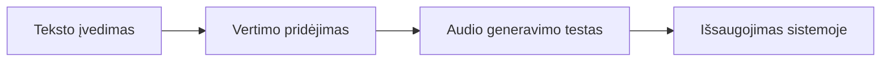
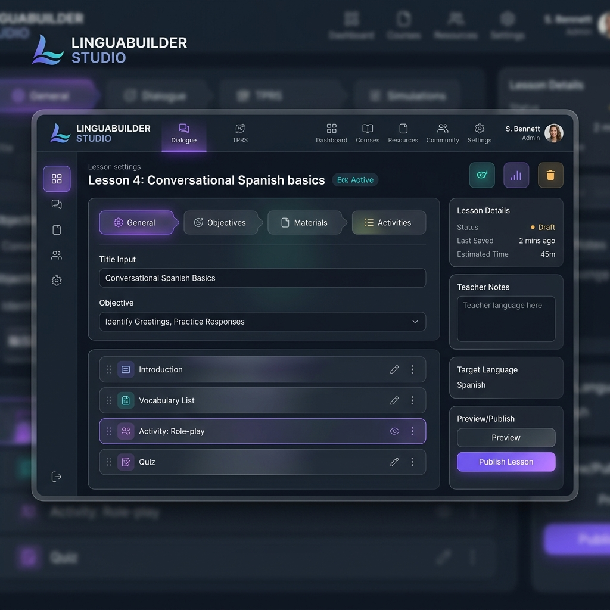

# 🛠️ Studio: Turinio pildymo vadovas

Sveiki, turinio kūrėjai! Šis vadovas padės jums efektyviai valdyti mokymo medžiagą **LtEng_26** platformoje per „Studio“ aplinką.

## 1. Kaip patekti į Studio
Studio rėžimas yra skirtas vartotojams su `EDITOR` arba `CREATOR` role.
1. Viršutiniame meniu pasirinkite „Studio“.
2. Atsidariusiame lange matysite visų pamokų sąrašą.

## 2. Pamokos Redagavimas
Paspaudę ant pamokos, pateksite į redaktorių, padalintą į logines dalis:

- **General (Bendra)**: Pamokos pavadinimas ir ikonėlė/paveikslėlis.
- **Dialogue (Dialogas)**: Pagrindinis pokalbis tarp veikėjų. Svarbu nurodyti, kas kalba (paprastai Teacher ir Student).
- **TPRS (Stalo pasakojimai)**: Metodikos dalis, skirta pasakojimui ir supratimo tikrinimui.
- **Simulations (Simuliacijos)**: Scenarijai „Sintetinei klasei“, kur konfigūruojami teatro režimo veiksmai.

### Turinio Srauto schema

## 3. Versijavimo galimybė
Jei padarėte klaidą ir išsaugojote neteisingą variantą – nesijaudinkite! Sistema kiekvieną kartą saugo senąją versiją į dev-žurnalą, kurį sistemos administratorius gali atstatyti.

> [!IMPORTANT]
> Visada paspauskite „SAVE CHANGES“ prieš išeidami iš rėžimo, kitaip pakeitimai dings.

---

*Studio aplinka: Jūsų įrankis kurti magiją klasėje.*
