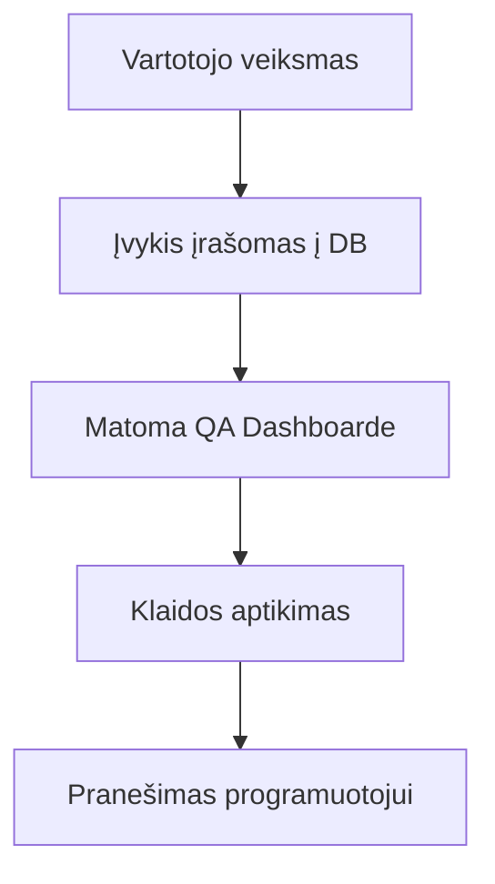

# 📊 QA Analytics: Kokybės užtikrinimas

Testuotojams skirta dokumentacija apie tai, kaip naudotis analitikos įrankiais ir užtikrinti sistemos veikimą.

## 1. QA Prietaisų skydelis (Dashboard)
Studio dalyje rasite skiltį „QA Analytics“, kuri skirta stebėti realią platformos sveikatą.

### Rodikliai, kuriuos turite stebėti:
- **Success Rate (Sėkmės koeficientas)**: Procentas, kiek studentų sėkmingai įveikia tarimo testus. Jei tam tikro žodžio sėkmė žema – gali būti problema su balso atpažinimo algoritmu.
- **Activity Trends**: Kada studentai aktyviausi. Tai padeda planuoti serverio apkrovas.
- **Recent History**: Kiekvieno įvykio (Event) išklotinė realiu laiku.

## 2. Testavimo eiga
Atlikdami kokybės patikrą, laikykitės šios sekos:

### Ką tikrinti per kiekvieną pamoką?
1. **Audio sinchronizacija**: Ar tekstas paryškinamas būtent tuo metu, kai jis ištariamas?
2. **Vertimų tikslumas**: Ar vertimas paslepiamas ir parodomas tinkamu metu (Mercy rėžimas)?
3. **PDF generavimas**: Ar sugeneruotame PDF matomi visi lietuviški simboliai (ą, č, ę...)?

> [!TIP]
> Naudokite „History Log“ filtrus, kad atsirinktumėte tik „ERROR“ tipo įvykius arba sekTumėte konkretų vartotoją.

---

*Testavimo tikslas: Kad studento aplinka būtų nepriekaištinga ir įkvepianti.*
