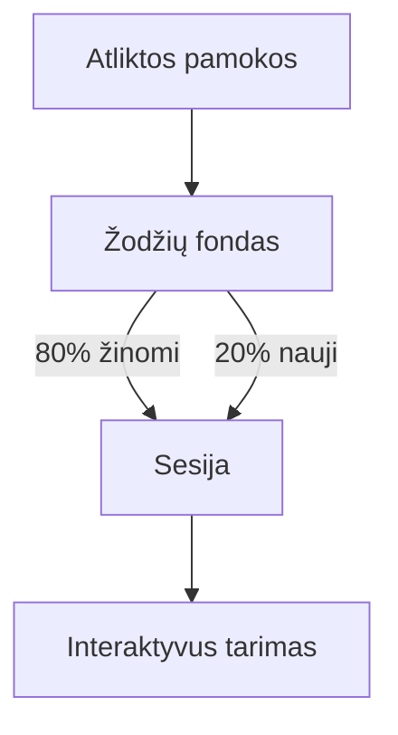

# 📖 Žodyno valdymas

Efektyvus žodyno pildymas yra pagrindas Dmitrijaus Petrovo metodikai. Šiame dokumente aprašoma, kaip valdyti sistemos žodyną.

## 1. Globalus žodynas
Skirtingai nei pamokų tekstai, žodynas yra globalus. Tai reiškia, kad vieną kartą suvestas žodis gali būti naudojamas keliose pamokose arba „Žodyno Teatro“ režime.

### Įrašo laukai:
- **English Word**: Angliškas žodis (pvz., "Knowledge").
- **Translation**: Lietuviškas vertimas.
- **Phonetic**: Transkripcija (naudojama vizualiai padėti studentui).
- **Type**: Žodžio kategorija (Veiksmažodis, Daiktavardis ir kt.).

## 2. Žodyno Teatras (Vocabulary Theater)
Šis rėžimas automatiškai parenka žodžius pagal studento lygį.

## 3. Geriausios praktikos
- **Trumpi pavyzdžiai**: Jei žodis turi kelias reikšmes, naudokite tą, kuri dažniausiai pasitaiko pasirinktuose tekstuose.
- **Audio testavimas**: Prieš patvirtindami, paspauskite garsiakalbio ikonėlę ir įsitikinkite, kad tarimas yra aiškus.

> [!CAUTION]
> Venkite dubliuoti žodžius. Jei žodis jau egzistuoja, geriau priskirkite jam papildomą pamokos numerį.

---

*Žodynas yra studento ginklas – paruoškite jį tinkamai!*
