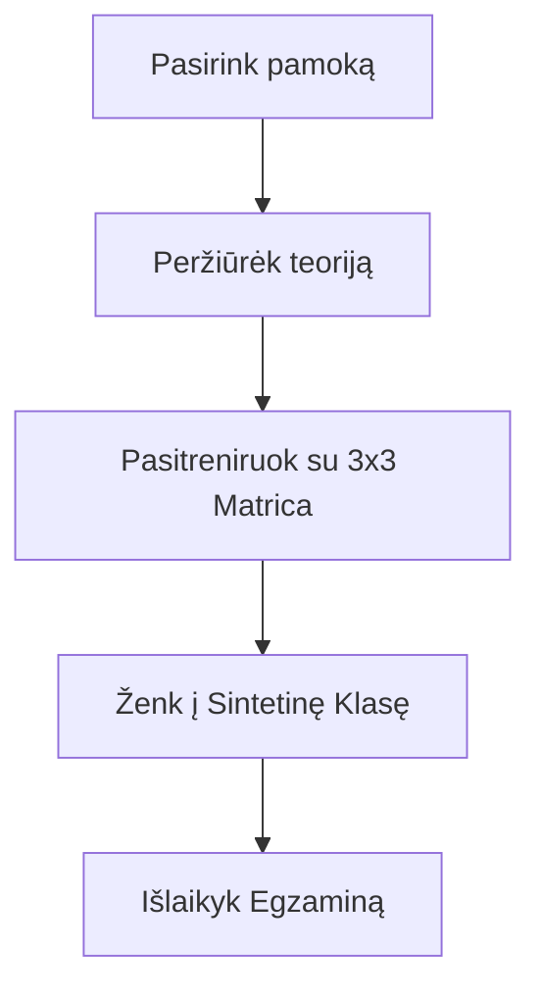

# 🎓 Pradžia: Sveiki atvykę į LtEng_26!

Džiaugiamės, kad pasirinkote mokytis anglų kalbos su mumis. Ši platforma sukurta taip, kad mokymasis būtų ne tik efektyvus, bet ir malonus.

## 1. Pirmieji žingsniai
Prisijungę prie sistemos, pateksite į pagrindinį valdymo langą (Dashboard). Čia matysite:
- **Pamokų progresą**: Kurias pamokas jau baigėte ir kas laukia toliau.
- **Žodyną**: Galimybę greitai pasikartoti žodžius.

## 2. Prieinamumas (Accessibility)
Mums svarbu, kad visi galėtų patogiai skaityti ir mokytis. Viršutiniame dešiniajame kampe rasite nustatymų piktogramą:
- **Teksto dydis**: Galite padidinti tekstą iki 150%.
- **Kontrastas**: Pasirinkite „High Contrast“ rėžimą geresniam matomumui.
- **Balsas**: Reguliuokite mokytojo kalbėjimo greitį.

## 3. Mokymosi ciklas

---

*Jūsų skaitmeninis stalas – viskas paruošta sėkmingam startui.*
