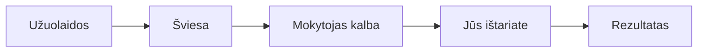

# 🎭 Sintetinė klasė (Teatro režimas)

„Sintetinė klasė“ yra LtEng_26 platformos širdis. Čia jūs ne tik skaitote, bet ir dalyvaujate gyvoje pamokoje su mokytoju.

## 1. Kas yra Teatro režimas?
Paspaudę „PRADĖTI KLASĘ“, visas ekranas paskęs tamsoje, prasideis užuolados ir užsidegs šviesos. Prieš jus pasirodys mokytojas, kuris ves jus per pamokos istoriją.

### Kaip tai veikia:
1. **Klausymas**: Mokytojas ištaria sakinį anglų kalba.
2. **Kartojimas**: Jums parodomas tas pats sakinys ir paprašoma jį ištarti.
3. **Analizė**: Sistema iškart pasako, ar ištarėte teisingai. Jei ne – galite bandyti dar kartą.

## 2. Valdymas sesijos metu
- **Pauzė (Freeze)**: Jei jums reikia pertraukos, paspauskite „FREEZE“. Viskas sustos tiksliai toje vietoje, kur buvote.
- **Tęsti**: Paspaudus dar kartą, pamoka tęsis toliau.

## 3. Patarimai sėkmei
- **Naudokite ausines**: Geresnė garso kokybė padės sistemai tiksliau atpažinti jūsų tariamus žodžius.
- **Kalbėkite užtikrintai**: Nebijokite klysti – mokytojas visada pasiruošęs palaukti.

---

*Jūsų scena, jūsų pamoka. Sėkmės mokantis!*
