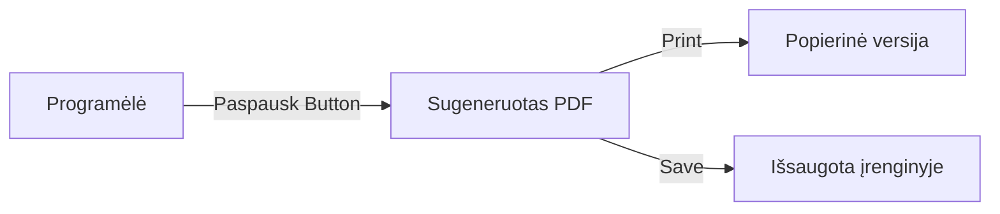

# 📄 Mokymasis neprisijungus: PDF Gidai

Mes suprantame, kad kartais norisi mokytis be ekrano – prie kavos puodelio ar kelionėje. Todėl LtEng_26 leidžia visą pamokos medžiagą pasiimti su savimi.

## 1. Kaip atsisiųsti pamoką?
Kiekvienos pamokos viršuje rasite du mygtukus:
- **SPAUDINTI (PDF)**: Sugeneruoja „Minimal“ stiliaus dokumentą. Jis yra juodai baltas, taupantis spausdintuvo dažus, su aiškiomis lentelėmis.
- **ATSISIŲSTI (STYLED)**: Sugeneruoja „Premium“ stiliaus PDF su spalvomis, iliustracijomis ir gražiu maketu. Puikiai tinka peržiūrai planšetėje.

## 2. Kas įeina į PDF?
Dokumente rasite visą pamokos informaciją:
1. **Teorija**: Gramatikos taisyklės ir paaiškinimai.
2. **Dialogas**: Visas pokalbis su vertimu į lietuvių kalbą.
3. **Istorija (TPRS)**: Pamokos pasakojimas.
4. **Žodynas**: Svarbiausių žodžių sąrašas su transkripcijomis.

## 3. Pavyzdys

> [!TIP]
> Rekomenduojame atsispausdinti „Minimal“ versiją ir žymėtis sau svarbias vietas pieštuku – tai puikus būdas įsiminti medžiagą!

---

*Mokykitės ten, kur jums patogu.*
